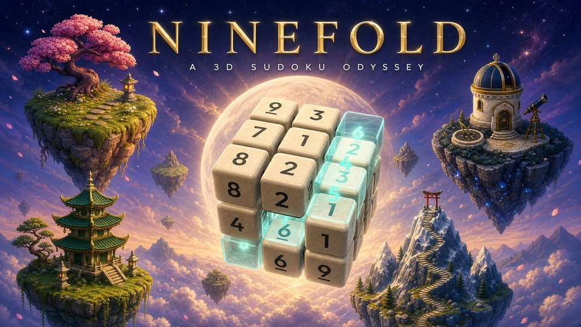

# NineFold — A 3D Sudoku Odyssey



> Sudoku leaves the page: 81 levels across nine realms, true 3D cube puzzles you turn and slice, Killer sums, memory and speed challenges, daily puzzles and a technique academy.

Built entirely by **Claude Opus 5.5**. Free in the browser.

## Play

- **Web:** open `index.html` (or deploy `www/` to any static host)
- **Installable PWA:** works offline via service worker (`sw.js`)
- **Android:** native APK built with Capacitor in CI (`com.ninefold.app`)

## Features

- **True 3D Sudoku** — 3×3×3 cubes (27 cells) where every flat slab in any direction holds 1–9 exactly once; larger 4×4×4 slice puzzles with 2×2 boxes
- **Rotate & Slice** — drag to turn the cube, Lens view to read one slab flat, Spread to pull layers apart, strip mini-maps to jump between slices
- **Killer cages** — dashed cages with sums, no repeats inside; single-combination and combo logic
- **Variants** — thermometers, Kropki dots, arrow sums, diagonals and shaded cells
- **Memory mode** — the board fades, play from memory
- **Speed mode** — timed rush levels in Storm Spire
- **Daily puzzles** — a new puzzle every day with streak tracking
- **Technique academy** — ~20 taught techniques from Full House and Hidden Singles up to X-Wing, Naked/Hidden Pairs & Triples, Pointing, Claiming, Cage Locks, Innies & Outies
- **Every puzzle solvable by pure logic** — no guessing ever required
- **Unlimited undo, notes (N), hints** — each digit plays its own note; finish a house to hear a chord

## The Nine Realms

| #   | Realm            | Skill                                |
| --- | ---------------- | ------------------------------------ |
| 1   | Dawn Garden      | Foundations                          |
| 2   | Crystal Lattice  | Intersections                        |
| 3   | The Hollow Cube  | Spatial                              |
| 4   | Ember Forge      | Arithmetic (Killer sums)             |
| 5   | Mirror Lake      | Memory                               |
| 6   | Storm Spire      | Speed                                |
| 7   | Jade Labyrinth   | Variants                             |
| 8   | Star Observatory | Advanced logic (wings, fish, chains) |
| 9   | The Summit       | Mastery — everything at once         |

9 realms × 9 levels = **81 levels**.

## Controls

- **Tap** an empty tile, then a number below to place it
- **Drag** to rotate 3D cubes; use the **Lens** for a flat slab view
- **Notes:** tap Notes (or press `N`), then numbers
- **Undo** is unlimited

## Tech

- Zero-build frontend: `game.js` + `app.css`, no bundler
- 3D via **Three.js** (WebGL), puzzle generation in a Web Worker (`gen.worker.js`)
- **Capacitor 8** for Android; **Preferences** plugin for saves
- **PWA**: `manifest.webmanifest` + offline-first `sw.js`
- Package manager: **pnpm**

## Develop

```sh
pnpm install
```

Live-preview with any static server, e.g.:

```sh
npx serve .
```

### Scripts

| Command             | What it does                                |
| ------------------- | ------------------------------------------- |
| `pnpm www`          | Stage the web build into`www/`              |
| `pnpm sync:android` | Stage web + sync Capacitor Android platform |
| `pnpm open:android` | Open the project in Android Studio          |
| `pnpm vendor`       | Copy Capacitor runtime files into`vendor/`  |
| `pnpm format`       | Prettier-format the repo                    |

## Mobile (Android)

```sh
pnpm sync:android
pnpm open:android
```

CI (`.github/workflows/android.yml`) builds a versioned APK automatically on `v*` tags. Web deploys to GitHub Pages on every push to `main` (`.github/workflows/pages.yml`).

## Project structure

```text
index.html            entry point, PWA + Capacitor bootstrap
game.js               all game code (levels, solver, renderer, UI)
app.css               all styles
gen.worker.js         background puzzle generation (built at runtime)
sw.js                 offline service worker
manifest.webmanifest  PWA manifest
assets/               fonts + icons
vendor/               Capacitor runtime (generated by `pnpm vendor`)
ninefold.jpg          banner art (this README's header)
www/                  staged web build for Capacitor/Pages
```

## A note on the science

Practising puzzles reliably makes you better at those puzzles and closely related tasks. Whether they raise general intelligence, improve everyday memory, or prevent cognitive decline has **not** been established — so this game claims no "brain age" and computes no single combined score. A mix of puzzles, movement, sleep and time with people is the best-supported recipe for a sharp mind.

## Credits

Designed and built by **Claude Opus 5.5**, after a research review of puzzle design, cognitive science and learning.
